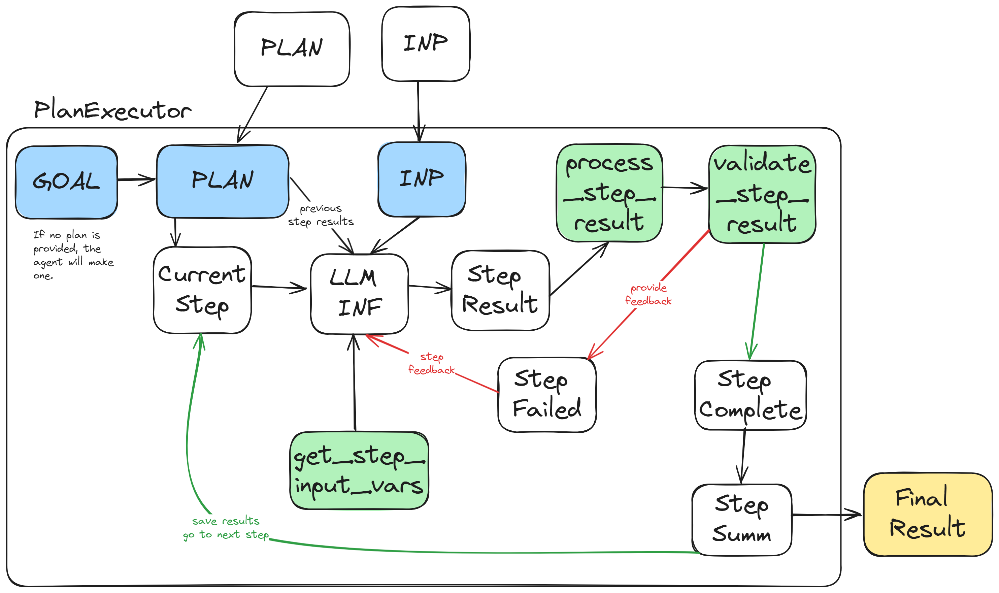
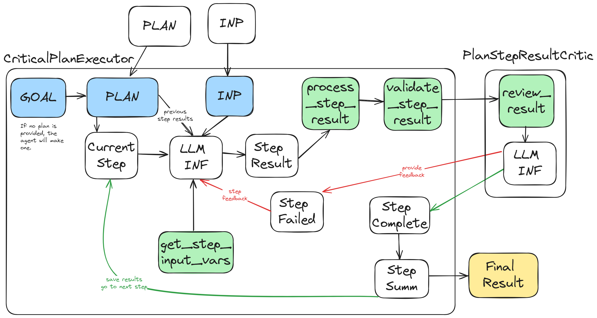

# Quick Start

<!-- TODO add links to templates -->

```bash
cd /path/to/agentlib
pip install -e .
```

### Project Setup

Then in your component's directory you make a `prompts` dir. This will be where your prompts are loaded from

```
myproject/
  '- prompts/
      |- my_prompt.j2
      |- my_agent.system.j2
      '- my_agent.user.j2
  '- src/
      '- my_agent.py
```

The prompts are writen in [Jinja2](https://jinja.palletsprojects.com/en/3.1.x/) templating langauge.

### Performing One-Off LLM Inferences

Before diving into agent classes, where is how you can make a single simple call to a LLM

```python
from agentlib import LLMFunction, CodeExtractor

my_f = LLMFunction.create(
  # First arg is the system prompt
  'Prompts can be a template string {{ foo.bar }} with jinja2 templates',
  # Following args are user prompts
  'my_prompt.j2', # You can also specify a prompt file from ./prompts. Following args are user prompts
  # Put as many messages as you want here.
  # They can also be LangChain ChatMessages / ChatMessageTemplate types

  # Choose what model you want to run. See Avaiable LLM section
  model = 'gpt-4o',

  # Prints to the terminal can can be viewed with `agentviz`
  use_logging=True,

  # OPTIONAL: output parser can be specified here. See Output Parser section
  output = CodeExtractor(langauge='c++'),

  # Other args for the LLM
  temperature=0.0
)

# Now run an inference with these prompts with input template variables
# By default it returns a string, unless you provide an output parser
inf = my_f(
  foo = dict( bar='hello' )
)
```

### Simplest Agent Example

"Agents" are python classes which perform one or more inferences with extra logic attached

```python
from agentlib import Agent

class MyAgent(Agent[str, str]):
    __SYSTEM_PROMPT_TEMPLATE__ = 'my_agent.system.j2'
    __USER_PROMPT_TEMPLATE__ = 'my_agent.user.j2'

    # In agentlib and langchain, all agents are serializable objects
    #   using pydantic you define your instance member variables like this
    #   instead of using __init__ and setting on self
    # See https://docs.pydantic.dev/latest/concepts/models/
    some_field: str = "foo"

if __name__ == "__main__":
    a = MyAgent(some_field="bar")
    res = a.invoke(dict(
        hello = "world" # Provide template variables this way
    ) # Run the agent
```

The simplest agent doesn't do much more than the LLMFunction, but you can use more complex agents
such as `PlanExecutor` agents, or `Critic` agents. They function together to perform complex tasks.

See the docs towards the end for a list of avaiable agent superclasses

# LLM API Support
For AIxCC we will not have direct access to the LLM endpoints from OpenAI, Anthropic, Google etc.

Instead we will be given access to a LiteLLM endpoint. Rather than use that directly, we have a
wrapper API confusingly called the "LLM API". This wrapper performs additional logging and analysis.

One major difference is that the LLM API expects a template and variables to be seperate, as well
as tracking conversation IDs and message indexes in those conversations.

Luckily this library fully supports that API! Simply define `USE_LLM_API=1` as an env variable.

> Note: One limitiation of the LLM API is that the Jinja2 templates cannot call methods. They can only access
variables and properties of those variables. This is because all the variables are converted to JSON first, so
imagine that all template variables are json objects, rather than python classes.

# Supported LLMS

The default LLM model is `gpt-4-turbo`

### OpenAI
* LLM API: ✅
* Tool Calling: ✅
* Structured output (json schema): ✅

```
o3-mini
o1
o1-mini
gpt-4o
gpt-4o-latest
gpt-4o-2024-11-20
gpt-4-turbo
gpt-4
gpt-3.5-turbo
gpt-4
gpt-4-turbo
gpt-4-turbo-preview
gpt-4o
```

### Anthropic
* LLM API: ✅
* Tool Calling: ✅
* Structured output (json schema): ✅

```
claude-3-5-sonnet
claude-3-5-sonnet-latest
claude-3-5-sonnet-20241022
claude-3-5-haiku
claude-3-opus
claude-3-sonnet
claude-3-haiku
```

### Gemini
* LLM API: ❌
* Tool Calling: ✅
* Structured output (json schema): ✅

```
gemini-1.5-flash
gemini-1.5-pro
gemini-1.5-pro-latest
gemini-1.5-pro-exp-0801
```

# Output Parsers
There are a few provided output parsers which can transform the LLM output into more structured data.

> IMPORTANT: When using an output parser, make sure to include `{{ output_format }}` in one of your prompts.
This will inform the LLM on how to structure the output. If you do not include this variable, the output parser
will not work.

### CodeExtractor
This will extract and combine all produced codeblocks. Provide a langauge to help inform the LLM.
```python
from agentlib import CodeExtractor, PythonCodeExtractor
# Generic code extractor which DOES NOT parse or validate the code
output=CodeExtractor(language='c++')
# Special parser for python which does syntax checks and extracts func name / args
output=PythonCodeExtractor()
```

This will produce a `Code` object with the following properties:
- `source_code` - Contains the extracted code. Multiple code blocks get combined
- `language` - The langauge of the code (from ```lang in the output)
- `name` - Function name. Only present in Python code
- `arguments` - Function arguments. Only present in Python code

### JSONParser
You can use the `JSONParser` to extract and parse JSON data from the LLM.

Sometimes LLMs fail at producing valid json. If your output is a JSON object `{...}` and you are using
a compatible model (gpt-*) you can enable `object_mode=True` which will force the LLM to produce valid JSON.

For other models, you can set `use_fallback=True` which will attempt to use gpt-4o to fix the output when parsing fails.

```python
from agentlib import JSONParser
output=JSONParser()
output=JSONParser(object_mode=True)
output=JSONParser(use_fallback=True)
```

### ObjectParser
If you want to specify a specific schema to extract structured data, you can use the ObjectParser.

To use this you first need to create a data class which subclasses the serialization class `SaveLoadObject`.
For each property you define in the class, you should use the `Field` method to provide a description of each property.
This description will be provided as part of the `{{ output_format }}` template variable.

```python
from agentlib import SaveLoadObject, ObjectParser, Field
class FooBar(SaveLoadObject):
    hello: str = Field(
        description="A detailed description of how this property should be used. The LLM will match the provided type hint.",
        optional = False,
        default = "World"
    )

output = ObjectParser(FooBar)
```

The output will be an instance of the class.

> Note: This performs schema validation, so if the LLM outputs a result that does not match the schema, an error will be raised

# Code Examples
- [Simple Chat Completion](examples/simple_chat_completion/) - An example of making an agent which performs a single chat completion (No tools or history)
- [Simple Chat With History](examples/simple_chat_with_history/) - An example of making an agent which can perform several chat responses across a conversation history
- [Bash Agent](examples/bash_agent/) - An example of an agent which can call bash commands via a tool
- [Follow Plan Agent](examples/follow_existing_plan) - An agent which follows a given plan, where a validation function decides if it succeeded at a given step and provides feedback
- [Patcher](examples/patch/) - A more complex example of an agent following a pre-defined plan to produce a patch for a file. This agent also uses a CriticAgent to review the result of each step

# AgentViz

You can get a nice visualization of the agent's behavior by running the `agentviz` command from the working directory of a running agent. (This is the directory the `volumes` directory was created in)

This is very nice for debugging the agent's behavior and seeing what tools are being called and what the agent is doing.

# Data Model

## Serializable

Most if not all objects and classes in agentlib are serializable. This means they can be saved to a JSON blob (via `o.to_json()`) and then reloaded (via `MyClass.from_json(json_str)`)

This is done via the pydantic library. See the following for an overview of how it works:

https://docs.pydantic.dev/latest/concepts/models/

## Making A Saveable Class via `LocalObject`

You can subclass the `agentlib.LocalObject` class to make a class which can be saved and then reloaded from disk.

To save a local object you call `o.save()`, this will populate the `id` field of the object with a UUID4 and then save the object to disk.


```python
from agentlib import LocalObject

class Foo(LocalObject):
    field1: str
    field2: int
    field3: List[str] = []

f = Foo(field1="foo", field2=1)
f.save()
print(f.id)
```

Then to retrieve the object you can call `MyClass.get_by_id(id)`:

```python
f2 = Foo.get_by_id(f.id)
```

# Provided Classes and Agents

<!-- TOC start -->

- [LLM Agent Classes](#llm-agent-classes)
   * [Agent](#agent)
   * [Critic](#critic)
- [Planning Agents](#planning-agents)
   * [Planner](#planner)
   * [PlanExecutor](#planexecutor)
   * [PlanStepResultCritic](#planstepresultcritic)
   * [CriticalPlanExecutor](#criticalplanexecutor)
- [Skills](#skills)
   * [SkillBuilder](#skillbuilder)
- [LLM Code Execution](#llm-code-execution)
   * [CodeExecutionEnvironment](#codeexecutionenvironment)
   * [PythonCodeExecutionEnvironment](#pythoncodeexecutionenvironment)
- [Tools](#tools)
   * [Built-in LangChain Tools](#built-in-langchain-tools)
   * [Custom Tools](#custom-tools)
   * [Existing Custom Tools](#existing-custom-tools)
      + [run_shell_command](#run_shell_command)
- [Data Models](#data-models)
   * [Creating Data Classes / LocalObject](#creating-data-classes--localobject)
   * [LocalObjectRepository](#localobjectrepository)
   * [Agents Are LocalObjects](#agents-are-localobjects)

<!-- TOC end -->


## Agent
The `agents.Agent` class is a wrapper around langchain's tool calling agent. Agents usually come in two classes:
- Simple: These agents perform a single LLM call when invoked. No tools or history. This uses a simple langchain LLM call
- Complex: These agents have chat history and can perform tool calls. This uses the actual langchain agent class

When invoked, the agent will use the provided system and user prompt to generate a response. You can also provide `chat_history` as a `ChatPromptTemplate` as additional history between the system and user prompts.

You can subclass Agent and override the configuration and behavior to suit your needs.

```python
# When you override Agent, you need to specify the Input and Output types here. In this example input=str, output=dict
class MyAgent(agents.Agent[str, dict]):

    # Optional: What local repo the agents are saved/loaded from
    __REPO__: LocalObjectRepository = LocalObjectRepository('my_agent') 
    # Optional: What LLM model to use, defaults to gpt-4-turbo
    __LLM_MODEL__ = 'gpt-4-turbo'
    # Optional: Specify any LLM arguments such as temperature, top_k, etc
    __LLM_ARGS__ = {}
    # Optional: Choose an output parser, defaults to plain text
    __OUTPUT_PARSER__ = JsonOutputParser

    # Optional:
    # Name of the prompt template files to use
    # If the file ends with .j2 it will be a jinja2 template
    # Otherwise it will use python's {} string format
    __SYSTEM_PROMPT_TEMPLATE__ = "myagent/agent_system_prompt.j2"
    __USER_PROMPT_TEMPLATE__ = "myagent/agent_user_prompt.j2"

    # You can override this to provide a list of tools to the agent
    # See https://python.langchain.com/docs/modules/agents/tools/
    def get_available_tools(self):
        return []

    # You can override invoke_agent to change the behavior of the agent
    def invoke_agent(self, input:dict={}, **kw: Any) -> AgentResponse[dict]:
        input = self.my_preprocess(input)
        res = super().invoke_agent(input, **kw)
        res = self.my_postprocess(res)
        return res

    # Any returned dict will be be passed as the template var `env` and a string rendered version in `env_md`.
    def get_env(self) -> Dict[str, Any]:
        env = super().get_env()
        env["my foos"] = "bar"
        return env

    # Any returned dict will be use as input template variables
    def get_input_vars(self) -> Dict[str, Any]:
        vars = super().get_input_vars()
        vars["some_thing"] = self.some_thing
        return vars

    # Several hooks for events
    def on_agent_action(self, handler, action: AgentAction, **kwargs: Any) -> Any:
        pass # Triggers when the underlying langchain agent performs an "action", such as running a tool
    def on_agent_finish(self, handler, finish: AgentFinish, **kwargs: Any) -> Any:
        pass # Triggers when the underlying langchain agent returns a response
    def on_tool_start(self, handler, serialized: Dict[str, Any], input_str: str, **kwargs: Any) -> Any:
        pass # Triggers when the underlying langchain agent starts a tool call
    def on_tool_end(self, handler, output: str, **kwargs: Any) -> Any:
        pass # Triggers when the tool finishes

    # Agents also provide a helper for one-off llm calls
    # The created function can be called multiple times with different inputs
    # Here is an example
    def my_example_llm_func_thing(self, name, foo="bar", examples=[]):
        f = self.create_llm_function(
            "foo/some_system_prompt.j2", # Loading a prompt from a file
            MessagesPlaceholder("chat_history"), # Optional, but allows for injecting chat history
            "Some inline template {name} {foo}",
            output="json"
        )
        return f(
            name=name,
            foo=foo,
            chat_history=examples
        )

    def my_example_more_helpers(self):
        pt = self.load_prompt("foo/some_system_prompt.j2", role="system")
        llm = self.get_llm_by_name("gpt-4-turbo", temperature=0.5, json=True)

class MyAgentWithHistory(agents.AgentWithHistory[str, dict]):
    # This agent keeps track of chat_history
    # It will auto provide the template variable chat_history, which is used to inject messages between the SYSTEM and USER prompts
    __SYSTEM_PROMPT_TEMPLATE__ = "myagent/agent_system_prompt.j2"
    __USER_PROMPT_TEMPLATE__ = "myagent/agent_user_prompt.j2"
```

## Critic
`agents.Critic` is an agent which decides if a given output has was successful or not. The critic will produce a `CriticReview` with feedback on the output.
```python
# Specify the input type the critic will review
class MyCritic(agents.Critic[dict]):
    # All the same config and overrides are available from Agent
    # Here are the new ones

    # All params you provide to the super().review_result will be passed as template vars
    # Or you can do whatever you want and return a CriticReview
    def review_result(self, result: dict, **kw) -> CriticReview:
        some_info = self.my_get_some_info(result)
        resp = self.super().review_result(
            result,
            some_info=some_info,
            **kw
        )
        return resp
        # OR
        resp = self.my_do_whatever_to_review_result(result)
        return resp
```


# Planning Agents
This set of agents allows you to plan out a series of tasks and then execute them. This is useful for complex tasks which require multiple steps.

## Planner
The `agents.Planner` is an agent which will make a "plan" when given a task.

Subclassing this allows you to define how that plan is formed.

```python
class MyPlanner(agents.Planner[str]):
    # All the same config and overrides are available from Agent
    # Here are the new ones

    # Provide a custom subclass of AgentPlanStep to add additional fields to the step
    __PLAN_STEP_CLASS__: AgentPlanStep = MyAgentPlanStep
```

## PlanExecutor

The `agents.PlanExecutor` is an agent which will make a plan of a series of tasks and then perform them one at a time. To form the plan, it kicks off a `PlannerAgent` instance.

Subclassing this allows you to define how that step is performed.

```python
class MyPlanExecutor(agents.PlanExecutor[str, dict]):
    # All the same config and overrides are available from Agent
    # Here are the new ones

    # Optional: What planner agent to use, defaults to agents.Planner
    __PLANNER_CLASS__: Any = MyPlanner
    # Max times a step can be attempted before failing
    __MAX_STEP_ATTEMPTS__ = 10
    # Prompt to use to get unstructured data from the conversation
    __CONTEXT_EXTRACTOR_PROMPT__ = 'myprompts/context_extractor.j2'

    # Similar to Agent.get_input_vars, but includes the current step as context
    def get_step_input_vars(self, step: AgentPlanStep) -> dict:
        vars = super().get_step_input_vars(step)
        vars["some_thing"] = self.some_thing
        return vars

    # Override this function to determine if the step has been completed
    def validate_step_result(self, step: AgentPlanStep, result):
        return self.my_decide_if_step_is_done(step, result)

    # Called at the end of a step attempt if it passed validation
    def process_step_result(self, step: AgentPlanStep, attempt: AgentPlanStepAttempt) -> bool:
        super().process_step_result(step, attempt)
        result = attempt.result
        # This is where you can post process the output of a step
        # For example, you can save the output to a file
        # or extract some information from the output
        # or even modify the output
        attempt.result = some_post_process_func(result)
        step.save()

        # You must return True to indicate the step was successful
        # Or False to indicate the step failed
        return True

    def on_step_failure(self, step: AgentPlanStep, res):
        print(f"Step {step} failed with {res}")
        super().on_step_failure(step, res)
    
    def on_step_success(self, step: AgentPlanStep, res):
        print(f"Step {step} succeeded with {res}")
        super().on_step_success(step, res) # needed to trigger next step

    # Override this function to perform additional processing or analysis on the step
    def execute_step_attempt(
            self,
            step: AgentPlanStep,
            attempt: AgentPlanStepAttempt,
            **kw
    ):
        self.some_thing = self.some_thing + 1
        res = super().execute_step_attempt(step, attempt, **kw)
        res = self.my_postprocess(res)
        return res

```


## PlanStepResultCritic
Use this critic for your `PlanExecutor` critic. It will have `self.step` which is the current step being reviewed.
```python
class MyPlanCritic(agents.PlanStepResultCritic[dict]):
    __SYSTEM_PROMPT__ = 'myprompts/critic_step_system_prompt.j2'
```

## CriticalPlanExecutor

`agents.CriticalPlanExecutor` is a subclass of `PlanExecutor` which uses a `Critic` agent decide if the step has been completed successfully. If the critic decides the step has failed, the step will be retried a number of times before failing.

```python
class MyCriticalPlanExecutor(agents.CriticalPlanExecutor[str, dict]):
    # All the same config and overrides are available from PlanExecutor
    # Here are the new ones

    # Optional: What critic agent to use, defaults to agents.Critic
    __CRITIC_CLASS__: PlanStepResultCritic = MyPlanCritic
```


# LLM Code Execution

## CodeExecutionEnvironment
This an abstract class provides the environment for running code and getting the result. Right now we only have a `PythonCodeExecutionEnvironment` which runs python3 code.

## PythonCodeExecutionEnvironment

```python
class MyPythonEnv(common.code.PythonCodeExecutionEnvironment):
    # The code templates are currently located in 'query_guy/execution_environments/'. These templates are jinja2 templates
    __CODE_TEMPLATE__ = "my_env_j2.py"
    # The template will be formated

    def module_entrypoint(self, code: common.code.Code, mod):
        # The templated code will be imported as a module in `mod`
        foo = mod.MyClass()
        res = foo.run_task() # for example the skill's run_task function
        return res

    # If you need to provide more template vars, you can override this
    def template_with_code(self, code: common.code.Code, **kw) -> str:
        # Default vars are `source_code` and `prefix` and `suffix`
        return super().template_with_code(
            code,
            some_template_var = "some value",
            **kw
        )
```

# Tools
Tools are functions that the agents can call automatically as part of their inference.

> Note: Right now we only support openai's toolcall API

## Built-in LangChain Tools
To see built-in tools provided by langchain: [LangChain Tools Docs](https://python.langchain.com/docs/modules/agents/tools/) and [LangChain Tools Source](https://python.langchain.com/docs/integrations/tools)

- [human_tool](https://python.langchain.com/docs/integrations/tools/human_tools) - Useful for letting the llm ask the user for input


## Custom Tools

The easiest way to turn a function into a tool is by using the `@langchain.tools.Tool` decorator.

```python
@Tool
def my_func_tool(
    input: str,
    some_arg: int = 1,
    some_other_arg: str = "foo"
) -> str:
    return f"some output {input} {some_arg} {some_other_arg}"
```

[See LangChain docs for more possible tools implementations](https://python.langchain.com/docs/modules/agents/tools/custom_tools)

## Existing Custom Tools
Here here the tools we have created which can be used by agents

### run_shell_command
`tools.run_shell_command` allows the LLM to run an arbitrary bash command and read the output.

# Data Models
Objects in this code implement the LangChain `Serializable` interface. This is done using pydantic's `BaseModel` class.

## Creating Data Classes / LocalObject
Making a new `Serializable` class is easy. Subclass `common.object.LocalObject` and define the fields you want at the top level of the class.

`LocalObject` has an `id: str` field which is a unique identifier for the object. This is used to fetch objects from repos (see below)

```python
from typing import List, Optional, Any, Dict
class MyData(LocalObject):
    field1: str
    field2: Optional[int] = None
    field3: List[str] = []

class MyData2(LocalObject):
    name: str = "my_data_2"
    some_other_data: Optional[MyData] = None
    # Avoid using __init__, but if you need to do it like this:
    def __init__(self, **kwargs):
        # Super will call the pydantic BaseModel's __init__ method
        # This will initialize and validate the fields via kwargs
        super().__init__(**kwargs)
        # Any attributes you define here will not get saved
        # Good for temporary state
        self.my_temp_var = "foo"

        # LocalObject provides an `id` field which is a unique identifier for the object
        print(self.id)

inst = MyData2(name = "foo", some_other_data = MyData(field1="bar"))

# Save the object to a file as json
inst.save_to_path(path="./some/file.json")

# Static method to load the object from a file
inst_copy = MyData2.from_file("./some/file.json")
```


## LocalObjectRepository
This class provides a simple way to save and load objects to the local file system. The objects are indexed by their `id` field and can be looked up by id.

```python
class MyObjectRepo(common.store.LocalObjectRepository):
    # Specify the directory where you want to store the objects
    __ROOT_DIR__ = Path("volumes/my_objects").resolve()
    
class MyObject(common.object.LocalObject):
    __REPO__ = MyObjectRepo('name_for_repo')

    field1: str

inst = MyObject(field1="foo")
# Will be saved into the repo
inst.save()

# Now you can fetch the object by its id
inst_copy = MyObject.get_by_id(inst.id)
```

## Agents Are LocalObjects
The `agents.Agent` class implements the `LocalObject` interface. This means that agents can be saved and loaded just like other objects. You can define new properties on the agent subclass and they will be saved and loaded with the agent.

By default they use an `AgentRepository` named `agents` (set on `Agent.__REPO__`).

```python
a = MyAgent()
a.do_some_inference()
a.save()

a_copy = MyAgent.get_by_id(a.id)
a_copy.resume_inference()
```

# Vector Stores / Retrieval
TODO: Add docs for vector stores and retrieval

# Debugging
If you want to use the [vscode python](https://marketplace.visualstudio.com/items?itemName=ms-python.debugpy) debugger, you can use the following setup.

The following `.vscode/launch.json` file will allow you to debug the code running inside the container. Make sure to change the paths to your local python env. You will probably want to install the packages in `pyproject.toml` in your local env (can be virtualenv, in which case you want to ctrl+p and type `>select interpreter`. For example my env was python3.11 but the container was running python3.10 so I had to map the correct paths below.

```json
{
    // Use IntelliSense to learn about possible attributes.
    // Hover to view descriptions of existing attributes.
    // For more information, visit: https://go.microsoft.com/fwlink/?linkid=830387
    "version": "0.2.0",
    "configurations": [
        {
            "name": "Attach to Debugger",
            "type": "debugpy",
            "request": "attach",
            "pathMappings": [
                {
                    "localRoot": "${workspaceFolder}/",
                    "remoteRoot": "/app/"
                },
                {
                    "localRoot": "/home/nyan/envs/queryguy/lib/python3.11/",
                    "remoteRoot": "/usr/local/lib/python3.10/"
                },
                {
                    "localRoot": "/usr/lib/python3.11/",
                    "remoteRoot": "/usr/local/lib/python3.10/"
                }
            ],
            "justMyCode": false,
            "debugServer": 5678,
            "preLaunchTask": "launch_docker_debugger"
        }
    ]
}
```
And then the following `.vscode/tasks.json`:
```json
{
    "version": "2.0.0",
    "tasks": [
        {
            "label": "launch_docker_debugger",
            "type": "shell",
            "command": "docker compose up debug --force-recreate -d && sleep 5",
            "presentation": {
                "reveal": "always",
            }
        }
    ]
}
```
Then you can just hit f5 and it should start the docker container and attached the debugger. Make sure to set breakpoints before starting the debugger.


# Not Very Useful / Not Fully Implemented

## Curriculum
`agents.Curriculum` is an agent which provides additional context to a task by answering questions about it.

```python
class MyCurriculum(agents.Curriculum[str]):
    pass
```

## Skills
Skills are tools which can be built by agents for agents. Currently skills are only in python3.

### Skill Model
TODO: Add skill model docs

### SkillBuilder
The `skill.SkillBuilder` class is a `CriticalPlanExecutor` which will build a python3 function that performs a given task. When the skill is complete it will be saved to a skill repository and can be used by other agents using that repository.

```python
# The output of a SkillBuilder is always a Skill instance
class MySkillBuilder(skill.SkillBuilder[str]):
    # All the same config and overrides are available from CriticalPlanExecutor
    # Here are the new ones
    __FUNCTION_PROTOTYPE_PROMPT__ = 'my_skill/my_function_prototype.j2'
    __RUN_TASK_STUB_PROMPT__: str = 'my_skill/my_function_call_for_task.j2'

    # Provide the class of the SkillRepository to save the skill to
    __SKILL_REPOSITORY__: SkillRepository = MySkillRepository
    # The curriculum is used to answer questions about the task to provide more context
    __CURRICULUM_CLASS__: SkillBuilderCurriculum = MySkillBuilderCurriculum
    # This provides the environment where the code will be executed while building the skill. This class will be attached to the skill for running by other agents
    __CODE_EXECUTION_ENVIRONMENT__: CodeExecutionEnvironment = CodeExecutionEnvironment

    # Names of existing skills which will always be provided as examples to the LLM
    __BASE_SKILLS__ = ['first_skill', 'second_skill']

    # Useful superclass fields for overriding child agents
    __PLANNER_CLASS__
    __CRITIC_CLASS__
```
There are several versions of the child agents which can be subclassed to control the specific prompts being used.
- `skill.SkillPlanner` - Breaks the task into `SkillPlanStep`s
- `skill.SkillBuilderCritic` - Decides if the chat history and the provided `CodeExecutionResult` were enough to complete the step
- `skill.SkillBuilderCurriculum` - Provides additional context to the task

Note: The skill builder will create a `run_task` function as the entrypoint of the generated code. This function has the following signature:
```python
def run_task(self) -> Any
```